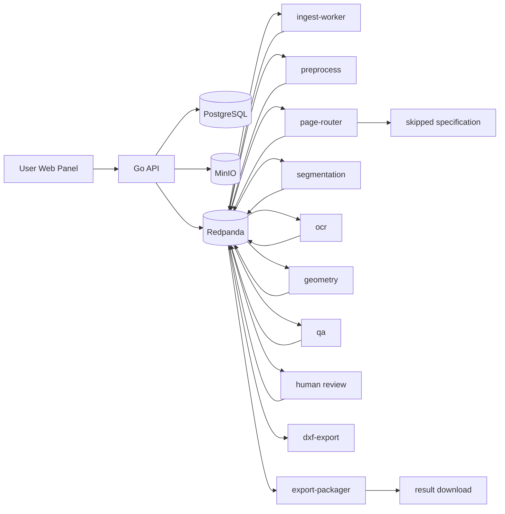

# Архитектура drawing2dxf

(Полная схема — `docs/architecture.mmd`. Сборка SVG/PNG: `make
docs-architecture`, требует Mermaid CLI.)

## Принципы

* **Метаданные в PostgreSQL, артефакты в MinIO.** PostgreSQL хранит только
  идентификаторы, статусы и URI; бинарные данные (raster, masks, CAD JSON,
  DXF, превью, QA) живут в MinIO под детерминированным деревом ключей
  `pages/<batch>/<file>/<page>/<artifact>.<ext>`.
* **Каждое событие — конверт с уникальным `event_id` и стабильным
  partitioning key (page_id).** Это позволяет workers быть идемпотентными:
  любая попытка обработать (page_id, stage) дважды просто перезаписывает
  артефакт по тому же ключу.
* **Mock/classical fallback всегда.** Если веса для YOLO/Paddle/SAM
  отсутствуют, сервис стартует в classical-режиме и продолжает pipeline.
* **Спецификации не в DXF.** Page-router помечает страницу
  `specification_sheet` → публикует `page.discarded_specification` →
  `pages.status = skipped` → последующие стадии (segmentation, OCR,
  geometry, DXF) такие страницы игнорируют.
* **Backpressure через Kafka group offsets.** Если worker не справляется,
  partition lag растёт, но producer (API) не блокируется.

## Порядок стадий

| Stage          | Topic in                          | Topic out                                 | Owner             |
|----------------|------------------------------------|--------------------------------------------|-------------------|
| ingest         | file.uploaded / archive.extracted  | page.extracted, archive.extracted          | ingest-worker     |
| preprocess     | page.extracted                     | page.preprocessed                          | preprocess        |
| route          | page.preprocessed                  | page.routed / page.discarded_specification | model-router      |
| segment        | page.segmentation.requested        | page.segmentation.done                     | segmentation      |
| ocr            | page.ocr.requested                 | page.ocr.done                              | ocr               |
| geometry       | page.geometry.requested            | page.geometry.done                         | geometry          |
| qa             | page.qa.requested                  | page.qa.done, page.review.required         | qa                |
| dxf            | page.export.requested              | page.export.done                           | dxf-export        |
| package        | page.export.done                   | (DB exports.uri update)                    | export-packager   |

## Безопасность ingest

См. `workers-go/ingest-worker/internal/security/`. Ключевые проверки:

* лимит количества файлов внутри архива (`MAX_ARCHIVE_FILES`);
* лимит глубины вложенности (`MAX_ARCHIVE_DEPTH`);
* лимит распакованного размера (`MAX_ARCHIVE_UNCOMPRESSED_BYTES`);
* MIME sniffing по магическим байтам (расширение не доверяется);
* запрет symlink и path traversal через `security.SafeJoin`;
* запрет absolute paths и `..` сегментов;
* `7zz`/`unar` запускаются в `exec.CommandContext` с фиксированным `PATH`,
  без shell, с тайм-аутом.

## Деградация без GPU / без моделей

Без обученных моделей и без GPU pipeline продолжает работать:

* Page router → `MockRouter` (rule-based);
* Segmentation → `MockSegmenter` (classical CV);
* OCR → пустой список + dimension parser;
* Geometry → полностью функциональный (RANSAC, skeletonization, snapping);
* DXF → реальный DXF через ezdxf.

QA `requires_review=true` чаще, чем после обучения моделей — это ожидаемо.
